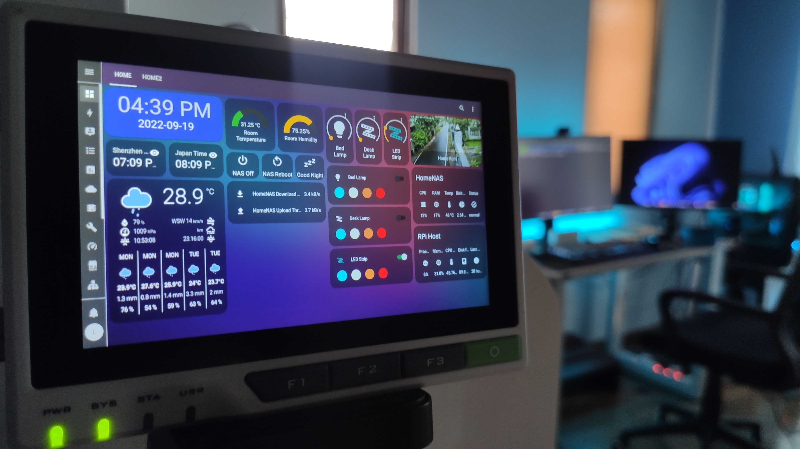

# W86_IoT
MQTT/AT/Home Assistant/SIM7600/

## SIM7600

- [official site](https://www.simcom.com/product/SIM7600X.html).
- [digikey sim7600 link](https://www.digikey.com/en/products/detail/simcom-wireless-solutions-limited/SIM7600SA/15841464) // [model list and price](https://www.digikey.com/en/products/filter/rf-transceiver-modules-and-modems/872?s=N4IgTCBcDaIMoEkCyB2AbABgyAugXyA).
- [waveshare SIM7600E-H 4G HAT page](https://www.waveshare.com/wiki/SIM7600E-H_4G_HAT). // [Industrial Grade SIM7600G-H 4G DTU](https://www.waveshare.com/product/sim7600g-h-4g-dtu.htm?sku=21137)

- [pdfs in 'sim7600-info' folder](./sim7600-info/).

## Home Assistant

- [Seed Studio link (see h.w. prices)](https://www.seeedstudio.com/home-assistant). //[The big display](https://wiki.seeedstudio.com/reTerminal_Home_Assistant/)
- [NABU CASA: commercial part of Home Assistance](https://support.nabucasa.com/hc/en-us) (it sells h.w. and cloud).
- 