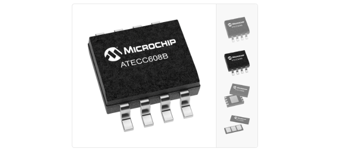
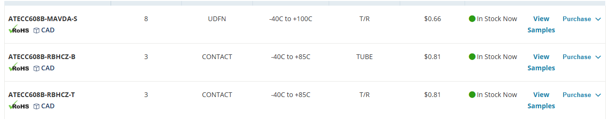
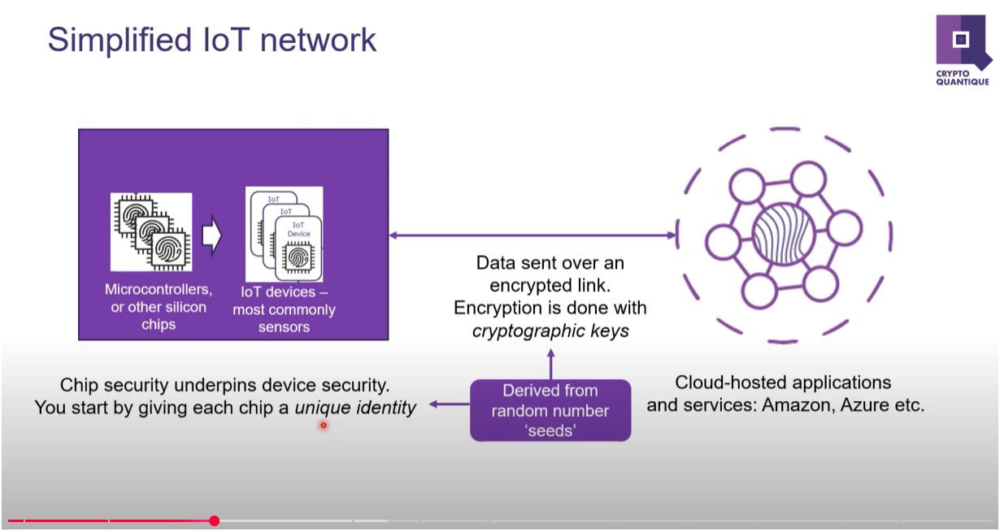
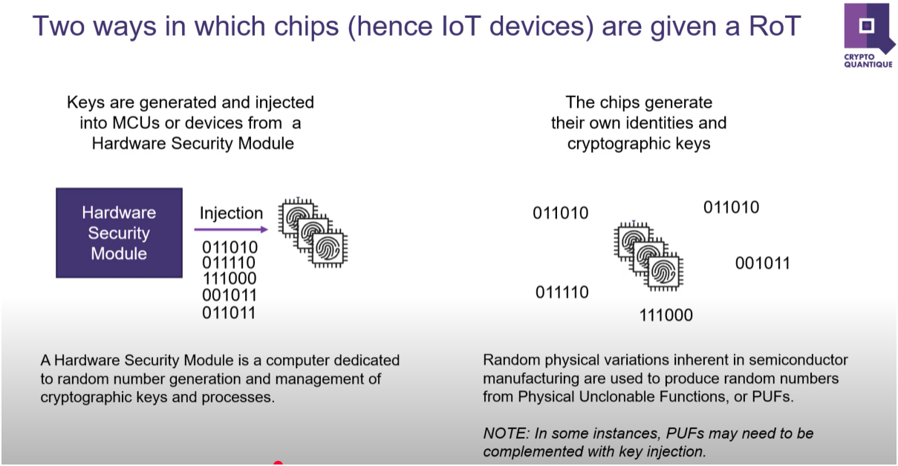
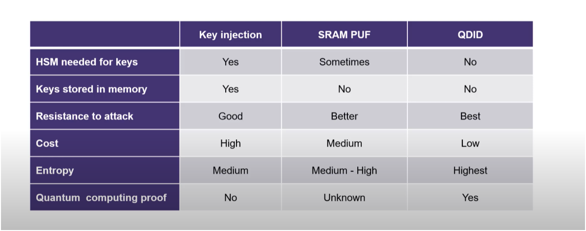
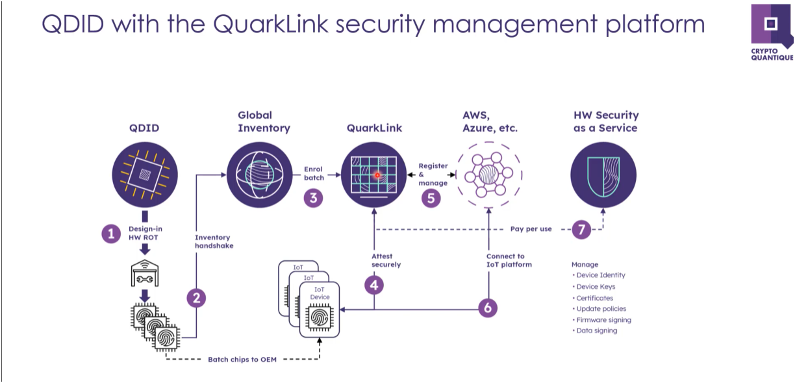
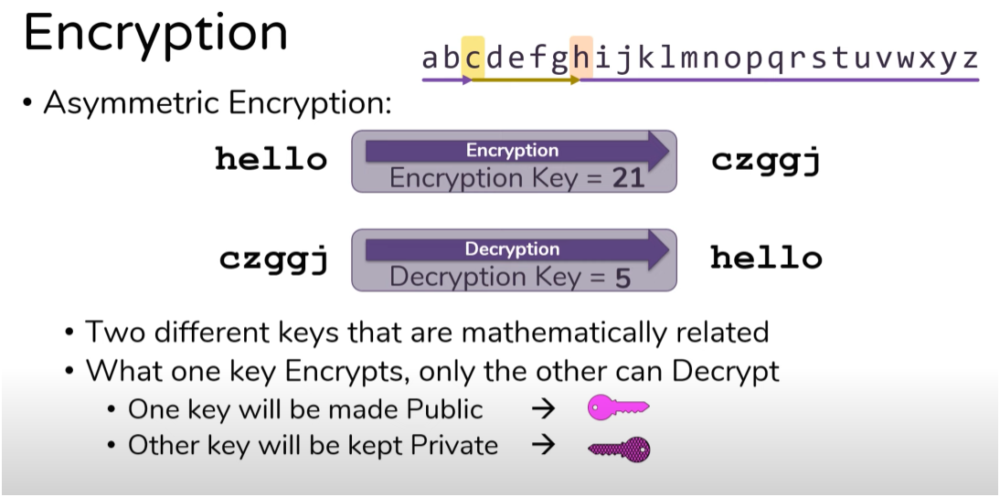
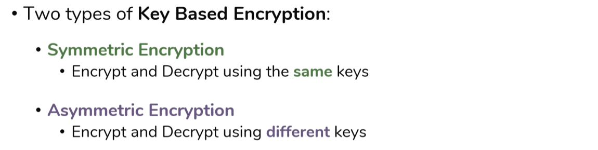
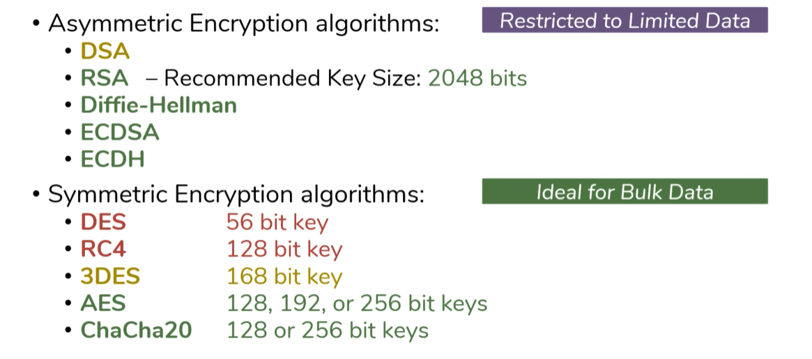

# Crypto Chip for Authentification

## 1. [>> Official link.](https://www.microchip.com/en-us/product/atecc608b)

## 2. The key is to give each chip a UNIQUE identity (https://www.youtube.com/watch?v=vZn2FU5Mn8Y)

## 3. Background knowledge: Asymmetric encryption

1. What is 'RSA': The RSA (Rivest–Shamir–Adleman) cryptosystem is a public-key cryptosystem, one of the oldest widely used for secure data transmission.
2. RSA is the algorthim to do Encryption and Decryption, there are others.
3. RSA is public
4. The public key is public
5. The private key is private 

-  https://www.youtube.com/watch?v=AQDCe585Lnc
-  https://www.youtube.com/watch?v=o_g-M7UBqI8
